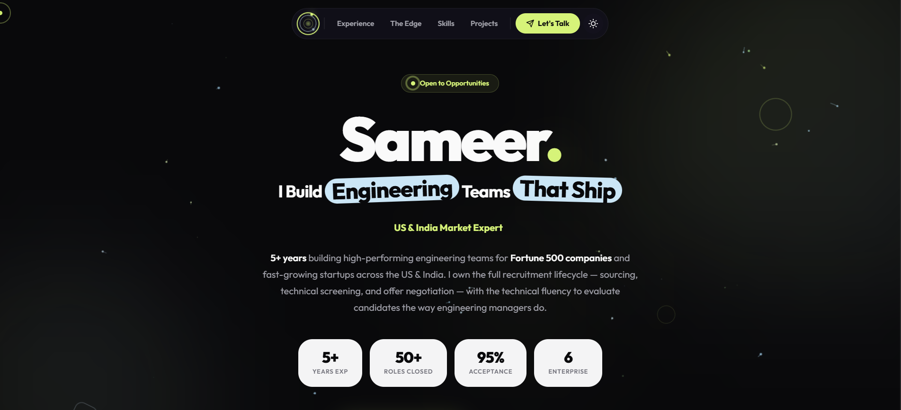
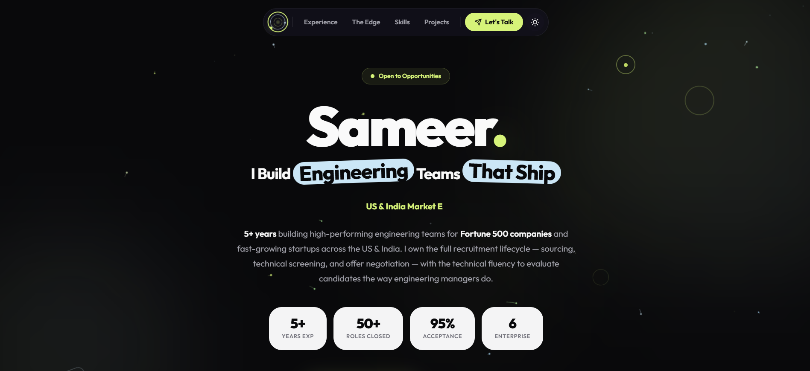

<div align="center">

# Sameer — Senior Technical Recruiter

**A premium, pixel-perfect portfolio built to showcase recruitment expertise with the technical depth of a developer.**


</div>

---

## Preview

<div align="center">




<br/>
<br/>



</div>

---

## About

This is not a typical recruiter portfolio. It's a **high-fidelity, single-page web application** designed to demonstrate something most recruiters can't: **I build what I recruit for.**

Every section — from the animated hero canvas to the dual-column layout — was crafted using a **Skill.md blueprint from [SkillShelf](https://skillshelf-liart.vercel.app/)**, an open-source Engineering Workbench that provides curated design blueprints for AI coding tools.

The result? A portfolio that **shows** rather than tells.

---

## Design System

| Token | Value | Usage |
|---|---|---|
| `surface` | `#09090B` / `#FAFAFA` | Primary background |
| `surface-card` | `#13111C` / `#FFFFFF` | Card backgrounds |
| `primary` | `#D6F379` | Lime green accent — persistent across themes |
| `accent-blue` | `#CBE6F6` | Icy blue highlights |
| `text` | `#FAFAFA` / `#09090B` | Primary text |
| `text-muted` | `#A1A1AA` / `#71717A` | Secondary text |
| `radius` | `24px – 9999px` | Heavy corner radii (pill-heavy) |
| `easing` | `cubic-bezier(0.16, 1, 0.3, 1)` | Spring animation curve |

**Typography:** [Outfit](https://fonts.google.com/specimen/Outfit) — weights 400 through 900, tight letter-spacing.

---

## Features

- **Dramatic scroll reveals** — Apple-style fade-up with blur-to-sharp transitions powered by `IntersectionObserver`
- **Compound background animations** — Floating + rotating decorative elements for organic, premium motion
- **Animated hero canvas** — Neon lime & icy blue particle trails with bounce-boundary physics
- **Floating pill navigation** — Centered glassmorphic nav bar with backdrop blur
- **FOIT prevention** — Theme applied synchronously before first paint via inline `<script>` in `<head>`
- **Perfect light/dark toggle** — Smooth 500ms theme transitions with localStorage persistence
- **Dual-column layout** — Edge + Arsenal stacked on the left, Experience on the right for maximum content density
- **Full-width project grid** — Side projects span the complete container with auto-fit columns
- **Responsive at every breakpoint** — Graceful collapse from dual-column to single-column on mobile
- **Custom cursor** — Lime green dot + ring with scale micro-interactions on hover
- **Zero dependencies** — Pure HTML, CSS, and vanilla JavaScript. No frameworks, no build step.

---

## Tech Stack

HTML5
CSS3 (custom properties, animations, IntersectionObserver)
Vanilla JavaScript
Canvas API (particle trail animation)
Google Fonts (Outfit)


---

## SkillShelf Blueprint

This portfolio was built using the **Dramatic Design System** Skill.md from [SkillShelf](https://skillshelf-liart.vercel.app/) — an open-source Engineering Workbench that provides curated, high-end design blueprints for AI coding tools.

The Skill.md file defines:

- **Color tokens** — Semantic light/dark mode mapping with persistent brand accents
- **Typography scale** — From 12px labels to 88px display headers
- **Animation foundations** — Spring easing curves, scroll reveal patterns, compound motion
- **Component rules** — Pill buttons, rounded cards, accent-blue text pills, floating nav
- **Accessibility requirements** — WCAG 2.2 AA contrast ratios, motion preferences

> One `.md` file. Pixel-perfect output. No guesswork.

**→ [Browse Skills on SkillShelf](https://skillshelf-liart.vercel.app/)**

---

## Project Structure

.
├── index.html # Complete single-file portfolio
├── image.png # Dark mode preview
├── image2.png # Light mode preview
└── README.md # This file


---

## Quick Start

```bash
# Clone
git clone https://github.com/Samyk000/portfolio.git

# Open
open index.html

# That's it. No build step. No dependencies.

Performance
Metric	Value
Dependencies	0
External scripts	0
Total page weight	~45KB
Canvas particles (desktop)	30
Canvas particles (mobile)	16
Animation frame budget	60fps capped
Tab visibility pause	✅
Delta-time normalization	✅
Connect
<div align="center">
LinkedIn
GitHub
Email

</div>
<div align="center">
Built with recruitment intelligence and engineering precision.

Crafted using SkillShelf design blueprints.

</div> ```
